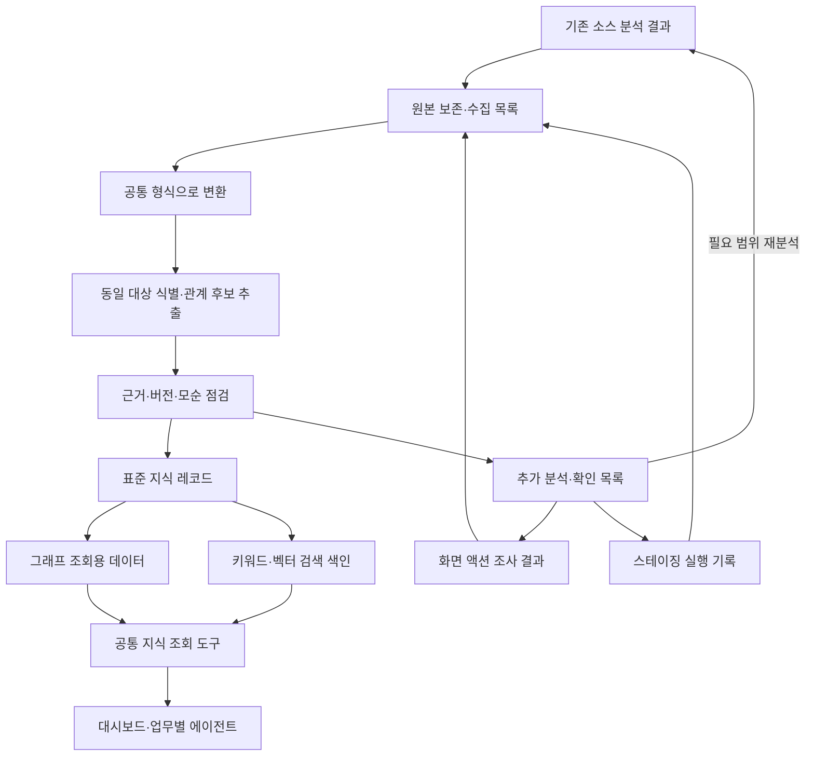

# 딜리버스 분석 결과의 지식화·그래프화 추진 계획

작성일: 2026-09-22 · 버전: 0.2

0.2 보완: 복합 API가 차세대에서 분리될 수 있다는 조건을 반영해 업무 흐름, 재사용 가능한 업무 책임, 버전별 구현의 다대다 대응을 명시했다.

## 1. 목적과 현재 출발점

이 계획에서 **지식화**는 분석 결과의 보존, 구조화, 식별자 통합, 관계 추출, 근거 연결, 검증, 그래프 적재, 검색용 벡터화, 에이전트 조회, 변경에 따른 갱신까지를 포함한다.

사용자가 설명한 현재 상태는 다음과 같다.

| 파이프라인 | 현재 상태 | 지식화에서 맡는 역할 |
|---|---|---|
| P1. Repomix 패킹 + Codex 프로젝트 소스 일괄 분석 | 1차 분석 완료 | 시스템·프로그램·API·데이터와 정적 관계의 초기 목록 |
| P2. 프론트 소스 기준 사용자 액션 전수조사 | 진행 중 | 화면·행동·조건·처리 결과와 구현의 연결 |
| P3. Android 에뮬레이터·프록시를 이용한 스테이징 실행 기록 | 계획 중 | 특정 환경·조건·버전에서 관측한 요청·응답과 결과 |

최종 활용은 운영이슈 분석, 테스트 지원·실행, 개발 영향도 분석, 분석설계 지원, AWS 차세대 전환 검증이다. 차세대는 큰 업무 기능을 유지하되 구현과 인프라의 상당 부분을 재설계한다.

현재 작업 폴더에서는 실제 분석 산출물을 찾지 못했다. 따라서 이 문서는 사용자가 설명한 진행 상황에 기반한 추진 계획이다. 기존 분석의 정확도, 입력 파일 형식, 규모, 기술 스택, 실행 가능 환경은 실제 자료 점검 단계에서 확인한다. 특정 제품을 확정하거나 분석 품질을 검증한 상태는 아니다.

## 2. 순서에 대한 권고

**최소 공통 규격 → 기존 P1 자료로 초기 지식·그래프 구축 → P2·P3를 같은 규격으로 통합 → 질문으로 검증 → 전체 범위 확대** 순서로 진행한다.

- P1 결과만으로도 지식화를 시작할 수 있다. 보고서에서 추출한 설명과 관계에는 그 수준의 근거 상태를 붙인다.
- P2·P3가 끝날 때까지 기다리지 않는다. 지식 그래프는 근거가 추가되면서 보강되는 구조로 만든다.
- 전체 그래프 플랫폼을 완성한 뒤 분석을 재개할 필요도 없다. 먼저 식별자·관계 종류·근거·버전·출력 형식만 맞춘다.
- 이미 수행한 분석을 전부 재실행하지 않는다. 기존 자료를 변환하고, 누락·모순·근거 부족이 확인된 범위만 원본 코드나 실행으로 보완한다.
- 분석 작업은 계속하되, 새 산출물에는 공통 규격을 적용한다. 이미 만들어진 산출물에는 변환 단계를 둔다.

결정 순서는 데이터 연결 규칙, 대표 질문, 초기 그래프 모델, 저장·조회 제품이다. 제품 선택이 데이터 모델 설계를 대신하지 않도록 한다.

## 3. 전체 작업 흐름



원본 자료와 표준 지식 레코드가 복구·재생성의 기준이다. 그래프 DB와 검색 색인은 이 기준에서 생성한다. 초기에는 지식 레코드의 편집 경로를 한 곳으로 정하고, 동일 사실을 파일과 DB에서 각각 독립 수정하지 않는다.

## 4. 먼저 마련할 최소 기반

처음부터 모든 예외를 모델링하지 않는다. 아래 항목을 대표 기능에 적용할 수 있을 정도로 정의한 뒤 실제 자료로 보완한다.

### 4.1 공통 식별자와 버전

| 항목 | 규칙 |
|---|---|
| 업무 흐름·단계 ID | 사용자의 목적과 단계·분기·상태 변화를 식별한다. 단계는 재사용 가능한 업무 기능을 참조한다. |
| 업무 기능 ID | 구현 기술과 무관하게 부여한다. 이름이 바뀌어도 동일 기능이면 유지한다. 의미가 바뀌면 변경 이력을 남긴다. |
| 화면·액션 ID | 버튼 문구나 파일의 줄 번호만으로 만들지 않는다. 동일 UI와 서로 다른 업무 행동을 구별한다. |
| API ID | 서비스, HTTP 메서드, 정규화 경로를 식별 근거로 삼는다. 게이트웨이 경로와 내부 경로는 명시적으로 매핑한다. |
| 프로그램 ID | 저장소·파일·심볼을 식별 근거로 삼고 이동·이름 변경은 대응 관계로 남긴다. |
| 증거·실행 ID | 실행과 증거를 구별한다. 한 실행에 여러 요청과 화면 증거가 연결될 수 있다. |
| 기준 버전 | 앱 빌드, 프론트 배포, 백엔드별 커밋·배포, 환경을 묶는 baseline ID를 둔다. |
| 미확인 버전 | 모르는 값은 미확인으로 기록한다. 현재 버전이라고 추정해서 채우지 않는다. |
| 레코드 형식 버전 | 지식 스키마 버전과 제품·코드 버전을 구분한다. |

식별자 통합은 별도의 처리 단계로 둔다. 코드의 API, 프론트의 호출 대상, 프록시의 실제 URL을 같은 대상으로 연결할 수 없는 경우 후보 매핑으로 남긴다. 이름이 비슷하다는 이유만으로 병합하지 않는다.

### 4.2 초기 그래프의 대상과 관계

초기 P1 그래프에는 실제 자료에 있는 대상만 넣는다. 아래 전체 목록이 모두 채워져야 적재 가능한 것은 아니다.

| 대상 유형 | 내용 | 주된 입력 |
|---|---|---|
| Flow / Step | 목적을 달성하는 업무 흐름과 단계·분기 | P1·P2와 업무 확인 |
| Feature | 독립적으로 설명·검증 가능한 업무 기능 또는 책임. 여러 흐름에서 재사용 가능 | P1·P2와 업무 확인 |
| Screen / Action | 화면·사용자 행동·자동 발생 동작 | P2 |
| API | 외부에 노출되거나 내부에서 호출하는 인터페이스 | P1·P2·P3 |
| Component / CodeSymbol | 서비스·모듈·함수 등 구현 요소 | P1 |
| DataObject | 테이블 등 데이터 구조 | P1, 필요시 스키마 |
| Rule | 조건·제약·상태 변화 규칙 | P1·P2와 업무 확인 |
| Scenario / Run | 검증 시나리오와 개별 실행 | P2·P3 |
| Evidence | 분석 문서, 소스 위치, 화면, 요청·응답 등 근거 | 모든 파이프라인 |
| Decision / Mapping | 차세대 설계 결정과 현행 대응 | 차세대 분석설계 |

초기 관계는 `포함한다`, `구현한다`, `호출한다`, `읽는다`, `변경한다`, `규칙을 적용한다`, `검증한다`, `근거로 뒷받침한다`, `차세대에 대응한다` 정도로 시작한다. 관계마다 출발·도착 대상 유형, 방향, 허용 조건을 정의한다.

‘관련 있음’만으로 연결하지 않는다. 코드상 가능한 호출, 특정 실행에서 관측한 요청, 업무 담당자가 확인한 요구사항을 같은 의미의 관계로 취급하지 않는다.

### 4.3 지식과 근거의 공통 필드

| 묶음 | 필요한 정보 |
|---|---|
| 식별 | 레코드 ID, 유형, 명칭, 별칭, 스키마 버전 |
| 범위 | 프로젝트·서비스, 현행/차세대 구분, baseline ID, 환경 |
| 의미 | 설명, 입력·전제 조건, 상태 변화, 결과, 예외 |
| 연결 | 출발 ID, 관계 유형, 도착 ID, 관계 성립 조건 |
| 근거 | 증거 ID, 파일·섹션 또는 소스 커밋·파일·심볼, 추출 위치 |
| 검증 | 보고서에서 추출했는지, 소스를 확인했는지, 실행에서 확인했는지, 업무상 확인했는지 |
| 관리 | 생성 파이프라인·분석 도구/모델·설정 버전, 작성·확인 시각, 검토자, 갱신 상태, 모순 여부 |

‘근거 종류’, ‘검토 상태’, ‘최신성’을 별도 필드로 둔다. 예를 들어 과거에 실행 확인된 관계가 현재 배포에서는 재검증 필요 상태일 수 있다. LLM이 산출한 임의의 신뢰도 점수만으로 사실 여부를 판단하지 않는다.

### 4.4 보관 위치와 원본 권한

- 기존 보고서와 패킹 파일: 수집 시점의 원본으로 보존하고 해시·버전·위치를 목록화한다.
- 정리된 설명·관계·검증 정의: 초기에는 사내 Git의 Markdown 및 JSON/YAML 레코드를 기준 원본으로 관리한다.
- 캡처·영상·통신·실행 결과: 파일 저장소에 실행별로 보관한다. AWS 사용 시 S3를 후보로 둔다.
- 그래프 DB·검색 색인: 위 원본에서 생성하는 조회용 데이터로 관리한다. 원본 리비전과 생성 세대를 기록한다.
- 변경이 잦은 대량 실행 기록: 원본 실행 묶음과 조회용 목록을 분리한다. 모든 로그 행과 DB 거래 행을 지식 그래프에 넣지 않는다.

원본 통신 자료가 필요한 경우 접근을 제한해 보관하고, AI 검색용 자료에는 토큰·쿠키·개인정보 등을 제거한 사본을 사용한다. 원본과 사본의 관계를 증거 목록에 남기며, 조회 도구는 요청자의 자료 접근 범위를 유지한다.

### 4.5 업무 단위와 구현 단위의 분리

지식의 상위 구조는 업무 흐름으로 정리하고, 그 흐름이 사용하는 업무 기능·책임과 규칙을 독립된 항목으로 관리한다. 현행 API·코드·데이터는 각 업무 책임의 구현 근거로 연결한다. API 하나를 업무 기능 하나로 간주하지 않는다.

| 층 | 기록할 내용 | 식별 기준 |
|---|---|---|
| 업무 흐름 | 사용자의 목적, 시작·완료 상태, 단계, 분기, 취소·실패 흐름 | 업무 결과와 시나리오 |
| 업무 책임·규칙 | 어떤 조건에서 무엇을 판단·계산·변경하는가 | 입력·전제 조건·업무 결과·지켜야 할 조건 |
| 구현 | 화면 액션, API, 모듈·함수, 데이터, 앱 연계 | 실제 대상과 버전 |

예를 들어 현행 API A가 ‘주문 가능 여부 검증’, ‘주문 금액 계산’, ‘주문 생성’을 수행한다고 가정한다. 세 업무 책임은 각각의 항목으로 등록하고, A가 세 항목을 구현한다는 관계를 남긴다. 차세대에서 이 책임들이 여러 API나 모듈에 나뉘면 새 구현을 같은 업무 책임에 연결한다. 이 예시는 실제 딜리버스 API 분석 결과가 아니다.

업무 책임과 구현은 다대다로 연결한다. 한 API가 여러 책임을 수행하고, 한 책임도 여러 API·프론트·배치·이벤트 처리로 구현될 수 있다. 업무 흐름 사이에서 공유하는 규칙은 복제하지 않고 참조한다. 네트워크 호출이 없는 UI 액션도 구현 층에 유지하며, 별도의 업무 규칙이 확인되지 않으면 억지로 새 업무 책임을 만들지 않는다.

복합 API의 책임별 대응에는 다음을 남긴다.

- 어떤 입력·분기에서 그 책임이 실행되는지.
- 해당 책임의 코드 위치와 호출하는 하위 모듈.
- 읽거나 변경하는 데이터와 외부에 발생시키는 효과.
- 성공·실패·재시도·중복 요청 시의 업무 결과.
- 다른 책임과의 실행 순서, 함께 성공·실패해야 하는 범위, 보상·취소 처리.
- 각 판단의 근거와 확인 상태. 보고서만으로 분리할 수 없으면 책임 후보로 둔다.

책임을 별도 항목으로 분석했다고 해서 각각을 독립 API나 마이크로서비스로 배포해야 하는 것은 아니다. 차세대의 구현 경계는 데이터 소유, 일관성·트랜잭션, 변경 주기, 성능, 운영 조건을 함께 검토해 결정한다. 엔드포인트가 여러 일을 한다는 사실만으로 결함이나 분리 필요성을 확정하지 않는다.

기존 업무 의미가 유지되면 ID를 유지하고 구현 관계를 추가한다. 업무 의미가 변경되면 규칙·기능 리비전을 남기며, 실제로 분할·통합되면 새 ID와 대응 관계를 둔다. 현행 구현을 지우거나 차세대 예정 설계를 실행 확인된 사실로 취급하지 않는다.

## 5. 단계별 실행 계획과 완료 조건

### 단계 0. 기존 산출물 점검과 대표 업무 선정

**작업**

- P1의 프로젝트별 분석 파일, 입력 패킹 파일, 분석 지시문, 알려진 소스 버전을 목록화한다.
- 보고서가 파일·함수·API·SQL의 근거를 포함하는지 확인한다. 패킹 제외 범위와 코드 압축 사용 여부도 확인한다.
- P2의 현재 액션 목록 형식과 조사 범위를 점검한다. P3의 관측 가능한 환경과 버전 식별 방법을 확인한다.
- 대표 업무는 ‘상품 상세에서 옵션·수량 선택 후 장바구니 담기’를 우선 후보로 한다. 실제 자료와 실행 환경에서 끝까지 확인 가능한지 검토해 확정한다.
- 정상, 제한 조건, 실패, 통신이 관측되지 않는 분기를 대표 사례로 선정한다. 사례가 실제로 해당 기능에 존재하는지는 소스로 확인한다.

**산출물:** 입력 자료 목록, 자료 품질·누락 목록, 대표 업무 범위, 기준 버전 목록.

**완료 조건:** 무엇을 분석했고 무엇을 아직 모르는지 식별할 수 있으며, 대표 업무의 입력 파일을 찾아갈 수 있다. 버전 미확인은 명시적으로 남긴다.

### 단계 1. 최소 공통 규격과 변환 규칙 수립

**작업**

- 4장의 식별자·대상·관계·근거 규칙을 실제 대표 자료에 맞게 v0.1로 정한다.
- 업무 흐름·업무 책임·규칙과 API·코드의 구분을 적용한다. 복합 API 하나가 여러 업무 책임에 대응하는 예시를 포함한다.
- P1 기존 문서의 어느 필드·섹션을 어느 지식 항목으로 옮길지 정의한다.
- P2와 P3가 앞으로 출력할 공통 필드와 각 파이프라인 전용 필드를 정한다.
- 사람이 확인한 레코드 예시를 만들고, 분석 도구의 출력이 이 구조를 따르도록 한다.
- 필수 필드, 존재하지 않는 ID 참조, 관계 유형, 버전 표기 등을 검사할 기준을 정의한다.

**산출물:** 데이터 사전, 식별자 등록부, 지식 레코드 규격, 관계 규격, 파이프라인별 출력 규격, 정상·오류 예시.

**완료 조건:** 같은 액션이나 API가 세 입력에서 등장했을 때 대응 방법을 설명할 수 있다. 모르는 사실을 만들어 넣지 않고도 레코드를 생성할 수 있다.

이 단계의 최소 규격이 정해지면 P2 조사는 계속 진행하고 P3 기록도 시작할 수 있다. 전체 그래프 플랫폼 완성은 선행 조건이 아니다.

### 단계 2. P1 기존 분석을 초기 지식으로 변환

**작업**

- 기존 문서를 기능·API·프로그램·데이터·규칙 단위로 나눈다. 단락의 문맥과 원본 섹션 링크를 유지한다.
- 이미 구조화된 필드는 파싱·규칙으로 변환하고, 설명의 의미 해석이나 관계 후보 추출에 AI를 사용한다. 원본 소스에서 구조적으로 추출 가능한 심볼·호출·참조는 지원되는 분석 도구와 대조한다.
- 명시된 사실과 관계 후보를 추출하고, 별칭과 중복 대상을 정리한다.
- 복합 API에서는 입력 분기·검증·계산·상태 변경 등 수행 책임을 후보로 추출한다. 독립된 업무 결과나 규칙이 있는지 확인하고 업무 항목에 연결한다.
- 보고서에만 근거가 있으면 ‘보고서에서 추출’ 상태로 저장한다. 원본 코드를 확인하지 않은 내용을 소스 확인 완료로 표시하지 않는다.
- 근거로 제시된 코드가 있으면 대표 업무부터 실제 파일·심볼과 로직을 확인한다. 파일이 존재하는 것만으로 설명의 정확성이 검증됐다고 판단하지 않는다.
- 모순되는 설명, 미해결 API 대응, 없는 소스 참조를 추가 확인 목록에 올린다.
- 아직 없는 화면·액션·실행 증거를 임의로 채우지 않는다.

**산출물:** 초기 지식 레코드, 관계 후보, 근거 연결, 누락·모순 목록.

**완료 조건:** 대표 업무에서 식별한 각 대상과 관계를 원본 분석 또는 소스 근거로 되짚어갈 수 있다. 근거 부족 항목이 확인된 사실과 구별된다.

**이 시점의 활용:** 시스템 구조 설명, 관련 프로그램 찾기, 추가 분석 대상 선정. 특정 실행의 실제 원인 확정이나 업무 요구사항 확정은 추가 근거가 필요하다.

### 단계 3. 초기 그래프 적재와 관계 조회 검증

**작업**

- 단계 2의 대표 업무 레코드를 그래프로 적재한다. 검증 완료와 미확인 관계를 조회에서 구분한다.
- 기능→API→프로그램→데이터, 데이터→프로그램→기능 등 정방향·역방향 조회를 확인한다.
- 등록된 관계와 조사 범위를 함께 반환한다. 일부 자료만 넣은 결과를 시스템 전체로 표현하지 않는다.
- 동일 입력을 다시 적재했을 때 중복 대상·관계가 늘지 않도록 식별·갱신 규칙을 검증한다.
- 대표 조회를 이용해 그래프 전용 DB 후보의 구현 난이도와 운영 조건을 비교한다. 기존 관계형 DB 활용안도 비교 가능하도록 원본 레코드 형식은 제품과 분리한다.

**산출물:** 대표 업무 초기 그래프, 재적재 결과, 관계 조회 예시, 저장·조회 제품 선택 근거.

**완료 조건:** 등록된 관계를 원하는 방향으로 조회하고 근거까지 반환한다. 연결이 없는 경우 ‘없음’과 ‘조사되지 않음’을 구별할 수 있다.

벡터 검색은 이 단계의 필수 조건이 아니다. 정확한 ID와 관계 조회가 먼저 성립해야 한다.

### 단계 4. P2 액션 조사 결과를 연결

**작업**

- 화면·액션·조건·입력·전후 상태·결과와 프론트 구현 근거를 표준 레코드로 변환한다.
- 직접 호출 외에 상태 변경 후 호출, 화면 이동 후 호출, 지연 호출, 앱 기능 위임을 조사한다.
- 화면 진입·주기적 갱신 같은 자동 발생 동작을 사용자 행동과 구분해 기록한다.
- 활성·비활성·조건부 노출과 정상·제한·실패 분기를 정리한다. 모든 상태 조합을 무조건 열거하지 않고 업무 규칙과 위험에 따라 사례를 선정한다.
- P1의 API·프로그램과 연결한다. 연결되지 않는 항목은 P1 또는 P2의 보완 작업으로 돌린다.
- 액션을 업무 흐름의 단계와 책임에도 연결한다. API 하나를 호출하는 액션이 여러 책임을 시작하거나, 같은 책임이 여러 화면에서 사용되는 경우를 보존한다.
- 기능별 테스트 시나리오 초안을 만든다. 기대 결과는 현행 관측과 업무상 기대를 구분한다.

**산출물:** 화면 액션 그래프, 구현 대응 관계, 시나리오 초안, 화면·액션 조사 현황.

**완료 조건:** 대표 업무의 행동에서 관련 구현까지 추적할 수 있다. 통신 형태가 미확인인 행동과 확인된 행동이 구분된다.

### 단계 5. P3 실행 관측을 근거로 연결

**작업**

- 실행 ID, 시나리오·액션 ID, 전제 조건, 수행 순서, 행동 시각, 환경·배포 버전을 기록한다.
- 실행 전후 화면, 요청·응답, 요청 순서, 처리 결과를 하나의 실행 묶음으로 저장한다.
- 실제 요청을 정적 API 목록에 대응시킨다. 여러 요청, 반복 요청, 자동 요청은 개별 관측으로 남긴다.
- 행동과 요청의 인과 연결은 소스 호출 경로, 실행 계측, 요청 식별자 등으로 확인한다. 시간상 인접하다는 이유만으로 확정하지 않는다.
- 캡처 범위 밖의 네이티브·캐시·통신 경로 가능성을 기록한다. 요청이 보이지 않았으면 우선 ‘이 실행에서 미관측’으로 남긴다.
- 서버 내부 처리나 최종 데이터 변경이 필요한 질문에는 서버 로그·추적 또는 결과 조회를 추가로 연결한다.
- 서로 다른 baseline의 소스 분석과 실행 관측은 버전 대응을 확인하기 전까지 상호 검증 완료로 표시하지 않는다.

**산출물:** 실행·증거 그래프, 정적 분석과 실행의 일치·불일치·미확인 목록, 검증된 시나리오.

**완료 조건:** 대표 사례에 대해 무엇을 했고 무엇을 관측했는지 재구성할 수 있다. 코드상 가능 경로와 실제 관측 경로를 각각 조회할 수 있다.

Android 관측은 해당 앱·WebView·환경 범위의 근거다. iOS와 관측하지 않은 조건으로 확인 범위를 자동 확장하지 않는다.

### 단계 6. 검색·벡터화와 공통 지식 조회 도구

**작업**

- 기능·규칙·구현 설명과 장애 사례를 검색 단위로 만든다. 각 단위에 대상 ID, baseline, 근거, 검증 상태를 붙인다.
- 기능 요약과 구현 세부 설명은 수준을 표시해 나눈다. 전체 보고서를 하나의 벡터로 만들지 않는다.
- API·함수명·오류 코드 등은 정확 검색을 제공하고, 업무 표현·유사 증상에는 키워드·벡터 검색을 조합한다.
- 검색한 대상 ID에서 질문에 맞는 관계를 탐색한다. 관계 유형·버전·조건으로 범위를 제한하고, 결과가 제한되거나 잘렸으면 표시한다.
- ‘관련 항목 전체’ 질문은 정해진 관계 조회로 처리한다. 벡터 검색 상위 일부를 전체 영향 범위라고 표현하지 않는다.
- 공통 조회 도구는 대상 검색, 대상 상세, 의존·역의존 조회, 증거 조회, 시나리오 조회, 현행·차세대 비교를 제공하도록 설계한다.
- 조회 결과에는 대상·관계뿐 아니라 근거와 미확인 범위도 포함한다. 지식 조회와 테스트 실행·운영 변경 도구는 별도 인터페이스로 둔다.

**산출물:** 검색 색인, 조회 도구 명세, 근거를 포함하는 질의 결과, 대표 질문 평가 결과.

**완료 조건:** 7장의 질문으로 정답 대상·관계·근거를 찾을 수 있다. 근거가 없는 질문에는 부족한 정보를 명시한다.

### 단계 7. 전체 범위 확대와 지속 갱신

**작업**

- 대표 업무에서 검증한 규격을 다른 업무로 확대한다. 코드·화면·규칙·관측의 조사율을 따로 관리한다.
- 변경된 소스·문서·액션을 식별하고 관련 지식과 테스트를 재검증 대상으로 표시한다.
- 자동 분석 결과는 기존 검토 기록과 비교한다. 자동 추출이 담당자가 확인한 업무 규칙이나 설계 결정을 덮어쓰지 않도록 한다.
- 삭제·대체된 대상과 관계는 최신 조회에서 제외하되 과거 baseline의 이력은 유지한다.
- 그래프와 검색 색인의 반영 기준을 함께 기록한다. 서로 다른 반영 세대가 섞이면 일관된 기준으로 조회하거나 불일치를 표시한다.
- 새 증거, 해결된 운영이슈, 테스트 결과를 관련 기능에 연결한다. 전체 운영 로그 복제를 지식화의 전제로 삼지 않는다.

**산출물:** 정기·변경 기반 갱신 절차, 보완 작업 목록, 조사 현황, 버전별 지식 릴리스.

**완료 조건:** 대표 소스 변경 한 건에 대해 영향 지식 표시→재분석→검토→그래프·검색 갱신을 재현할 수 있다. 과거 버전 조회도 유지된다.

## 6. 진행 중인 작업에 지금 반영할 내용

| 작업 | 계속할 내용 | 지금 추가할 내용 | 다시 분석하는 조건 |
|---|---|---|---|
| P1 완료 자료 | 기존 결과와 원본 입력 보존 | 버전·근거·대상 ID를 붙여 표준 레코드로 변환 | 근거 누락, 모순, 잘못된 호출 연결, 제거된 구현 상세가 발견된 범위 |
| P2 액션 조사 | 기존 화면 전수조사 계속 | 화면/액션 ID, 조건, 상태 변화, 코드 근거, 호출 후보, 조사 상태 | 대표 양식에서 누락된 필드를 기존 결과로 복구할 수 없는 범위 |
| P3 실행 관측 | 환경 준비와 대표 사례 실행 | 실행/액션 ID, baseline, 전제 조건, 타임라인, 전후 화면, 캡처 범위 | 자료와 행동을 대응시킬 수 없거나 필요한 분기를 관측하지 못한 경우 |

P2와 P3를 멈추게 만드는 대규모 선행 구축은 피한다. 반대로 실행 맥락 없는 대량 통신 캡처를 먼저 쌓으면 재수행이 필요해질 수 있으므로 최소 기록 규격은 수집 전에 적용한다.

### 함께 진행할 수 있는 작업

- 단계 0~1에서 대표 자료 점검과 공통 규격을 먼저 맞춘다. P3 환경 준비는 이 기간에도 가능하다.
- 단계 1 이후에는 P1 변환·초기 그래프 작업과 P2 액션 조사를 함께 진행할 수 있다.
- P3는 대표 시나리오, 액션 ID, 실행 기록 규격이 준비되면 시작한다. P1 전체 변환이나 P2 전수조사 완료를 기다리지 않는다.
- 단계 6의 정확 검색과 관계 조회는 초기 그래프에서 먼저 검증하고, P3가 쌓이면 실행 증거를 포함하는 질문으로 확대한다.

### 역할 분담

| 역할 | 맡을 일 |
|---|---|
| 지식화 담당 개발자 | 공통 규격·ID·변환·적재·조회·갱신 구현과 데이터 품질 점검 |
| AI 분석 도구 | 기존 문서 구조화, 관계 후보 추출, 요약, 모순·누락 후보와 테스트 초안 제안 |
| 현행 시스템 담당자 | 주요 코드 관계, 업무 규칙, 예외 정책, 불일치와 차세대 변경 의도 확인 |
| 실행·테스트 담당자 | 시나리오·데이터 준비, 앱 실행, 관측 증거와 실제 결과 기록 |

한 사람이 여러 역할을 맡을 수 있다. AI가 생성한 후보와 사람이 확인한 사실은 기록상 구분한다.

## 7. 대표 업무의 평가와 확대 조건

### 7.1 평가 질문

| 질문 유형 | 확인할 내용 |
|---|---|
| 업무 설명 | 기능의 조건·결과와 관련 규칙을 근거와 함께 찾는가 |
| 구현 추적 | 액션→API→프로그램→데이터 경로가 올바른가 |
| 역방향 영향 | API나 데이터 변경에서 연결된 액션·기능 후보를 찾는가 |
| 통신 없는 사례 | 미관측과 통신 없음 판단을 구별하는가 |
| 간접·조건부 호출 | 조건과 중간 처리 관계를 설명하는가 |
| 정적/실행 차이 | 가능한 경로와 특정 실행에서의 관측을 구별하는가 |
| 버전 차이 | 다른 배포의 증거를 현재 사실로 사용하지 않는가 |
| 모순·정보 부족 | 불일치를 숨기지 않고 추가 확인 범위를 제시하는가 |
| 테스트 선택 | 영향받는 규칙·기능과 연결된 시나리오를 찾는가 |
| 복합 API | API 하나가 수행하는 여러 책임과 각 책임의 코드·조건을 구별하는가 |
| 차세대 대응 | 업무 기능을 기준으로 현행·차세대 구현과 변경 결정을 비교하는가 |

차세대 자료가 아직 없으면 마지막 항목은 미래 목표로 구분하고 초기 합격을 위해 가짜 데이터를 운영 지식에 넣지 않는다. 필요한 경우 별도의 설명용 데이터로 조회 방식만 검증한다.

### 7.2 사람이 확인한 비교 기준

대표 사례마다 정답 대상 ID, 정답 관계, 필요한 조건, 근거 위치, 미확인 부분을 사람이 확인한 비교 자료로 만든다. 설명 문장이 그럴듯한지뿐 아니라 다음을 측정한다.

- 검색된 대상·관계의 정확성 및 정답 기준 대비 누락.
- 서로 다른 대상을 잘못 병합한 건수와 동일 대상을 중복 생성한 건수.
- 근거가 주장과 실제로 일치하는지, 버전이 맞는지.
- 그래프만 사용할 때와 검색을 결합했을 때의 차이.
- 대표 질문의 응답 시간과 처리 비용. 허용 기준은 실제 운영 요구와 측정 결과로 정한다.

분모가 확정되지 않은 전체 시스템에 대해 전수 분석 완료율을 제시하지 않는다. 프로젝트·화면·관계·분기·실행 사례의 범위를 구분해 보고한다.

### 7.3 다음 범위로 확대하는 최소 조건

- 대표 범위의 필수 식별자와 근거 상태가 모두 기록되어 있다. 미확인 값은 미확인으로 표시한다.
- 확인된 관계에는 유효한 출발·도착 ID와 근거가 연결되어 있다.
- 평가에서 발견한 잘못된 확정 관계와 잘못된 버전 혼합이 해결되어 있다.
- 미해결 항목은 조회에서 식별되며, 답변이 조사 범위 이상으로 완전성을 주장하지 않는다.
- 같은 입력을 재처리해도 불필요한 중복이 생기지 않는다.
- 표본 변경을 반영한 뒤에도 과거 지식·근거를 조회할 수 있다.

## 8. 차세대 자료로 이어가는 방법

- 업무 기능을 중심에 두고 현행·차세대 구현을 각각 연결한다.
- 현행 API 하나의 책임이 여러 차세대 구현으로 분리되거나, 여러 구현이 통합되는 대응을 지원한다. API 대 API 대응만으로 전환 범위를 판단하지 않는다.
- 업무 규칙에도 리비전을 둔다. 기능의 큰 이름이 같아도 조건이 바뀌면 변경으로 기록한다.
- 유지·변경·폐기·분할·통합과 결정 이유를 매핑한다. 일대일 대응을 강제하지 않는다.
- 테스트 시나리오의 업무 기대 결과를 재사용하고, 실행 어댑터·API·화면 선택자는 새 구현에 맞게 바꾼다.
- 현행 실행 증거는 현행 동작의 근거로 사용한다. 차세대 성공을 증명하는 데에는 차세대 실행 증거가 필요하다.
- 응답 JSON의 바이트 단위 일치보다 업무상 결과와 상태 변화, 의도적으로 변경한 차이를 검증한다.
- AWS 인프라·배포·네트워크·권한·운영 의존 정보는 별도 분석으로 보완하고 관련 서비스와 연결한다. 세 파이프라인만으로 마이그레이션 설계가 완성됐다고 간주하지 않는다.

## 9. 초기 산출물의 권장 구성

아래는 향후 구현할 구조 제안이며, 이 계획 작성으로 실제 생성한 파이프라인이나 데이터베이스를 뜻하지 않는다.

```text
delivery-knowledge/
  README.md                    지식 범위·조회·갱신 방법
  contracts/                   식별자·대상·관계·파이프라인 출력 규격
  inventory/                   입력 자료·프로젝트·baseline·조사 범위 목록
  records/                     표준 대상·관계·설명·검토 레코드
  evidence-manifests/          외부 증거 파일·실행 묶음의 목록
  scenarios/                   테스트 조건·절차·기대 결과
  review/                      모순·미해결 대응·재검증 작업
  migration/                   현행·차세대 매핑과 결정
  evaluation/                  사람이 확인한 질문·정답·근거와 평가 결과
```

설명은 Markdown, 구조화 데이터는 JSON 또는 YAML로 관리한다. 두 형식에 같은 사실을 수동 중복 기록하기보다 구조화 메타데이터와 설명을 연결하거나 한 문서에 함께 둔다. 벡터·그래프 적재 파일은 이 원본에서 생성한다.

## 10. 당장 착수할 작업 순서

1. 기존 P1 결과와 진행 중인 P2 결과에서 같은 업무에 해당하는 실제 샘플을 고른다.
2. 입력 자료·소스 버전·누락 범위를 기록한다.
3. 샘플을 기준으로 공통 지식 레코드와 관계 규격 v0.1을 작성한다.
4. 기존 P1 결과를 변환해 작은 초기 그래프를 만들고 근거 조회를 검증한다.
5. P2의 신규 출력에 같은 규격을 적용하고 기존 결과를 변환해 합친다.
6. P3는 액션·실행·baseline ID가 붙은 대표 사례부터 기록해 합친다.
7. 사람이 확인한 질문으로 관계 정확도와 검색 효과를 비교한 뒤 전체 업무로 확장한다.

대시보드와 여러 에이전트의 본격 구현은 대표 업무에서 공통 조회 도구의 유용성을 확인한 다음 진행한다. 자료량과 산출물 형식이 확인되기 전에는 일정을 고정하지 않고, 각 단계의 산출물과 완료 조건으로 진척을 관리한다.

## 11. 기술 검토 시 참고할 공식 자료

- [Repomix 코드 압축](https://repomix.com/guide/code-compress): 패킹과 구현 상세 제거를 구별할 때 참고한다.
- [Neo4j GraphRAG 조회 구성](https://neo4j.com/docs/neo4j-graphrag-python/current/user_guide_rag.html): 검색 결과에 그래프 탐색을 결합하는 후보 방식이다.
- [PostgreSQL 재귀 조회](https://www.postgresql.org/docs/current/queries-with.html): 관계형 DB에서 관계 탐색을 구성하는 비교안이다.
- [Neptune Analytics 벡터 검색](https://docs.aws.amazon.com/neptune-analytics/latest/userguide/vector-similarity.html): AWS에서 그래프와 벡터 조회를 결합하는 제품 후보다.
- [Android 에뮬레이터 프록시](https://developer.android.com/studio/run/emulator-networking-proxy): 실행 관측 환경의 지원 범위를 확인할 때 참고한다.
- [Microsoft 도메인 분석 지침](https://learn.microsoft.com/en-us/azure/architecture/microservices/model/domain-analysis): 업무 영역·책임을 분석한 뒤 구현 경계를 검토하는 순서에 참고한다. 이 계획이 마이크로서비스 도입을 전제로 한다는 뜻은 아니다.

이 문서의 단계 구성, 데이터 모델, 완료 조건은 딜리버스의 설명된 목적에 맞춘 제안이다. 공식 문서가 특정 저장소나 구축 순서를 필수로 요구하는 것은 아니다.
